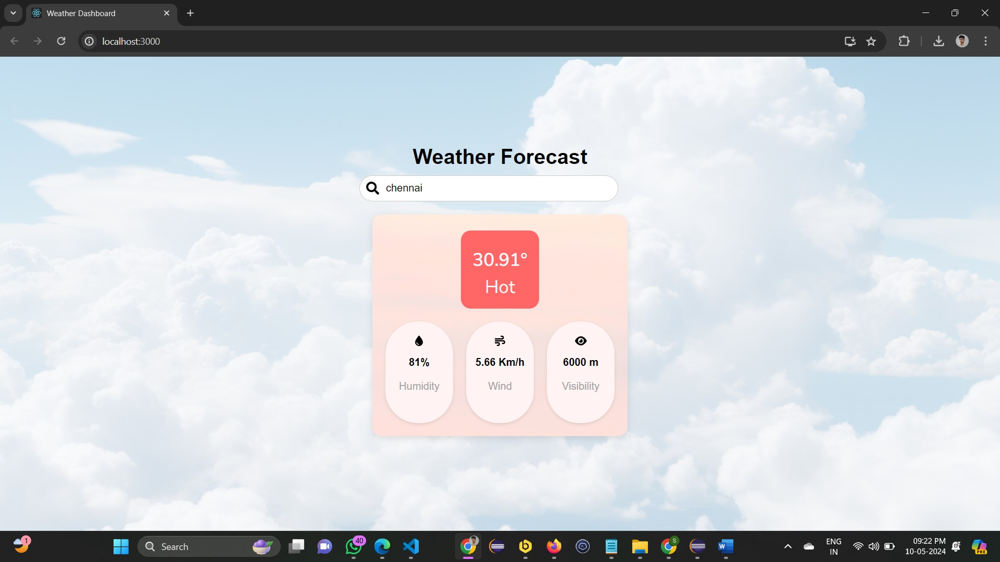

# Weather Application

 <!-- Replace # with the screenshot URL or path -->


## Description
A weather application that allows users to get real-time weather forecasts by searching for a city name. The application fetches data from the OpenWeatherMap API and displays current weather information, including temperature, humidity, wind speed, and visibility. The background dynamically changes based on the temperature range, creating a visually engaging user experience.

## Live Demo
You can try the live version of the weather application [here](https://sri1529.github.io/Weather_App/).

## Features
- Search weather by city name.
- Displays weather attributes such as temperature, humidity, wind speed, and visibility.
- Dynamic backgrounds and styles based on temperature.
- User-friendly interface with intuitive icons.

## Installation
To set up this project locally, ensure you have Node.js and npm installed. Then follow these steps:

1. Clone the repository:
   ```bash
   git clone https://github.com/sri1529/Weather_App.git
2. Navigate to the project directory:
    cd Weather_App
3.Install the dependencies
    npm install


## Run
To run the project locally, use:

    npm start
